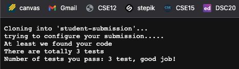
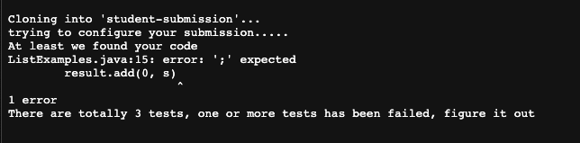
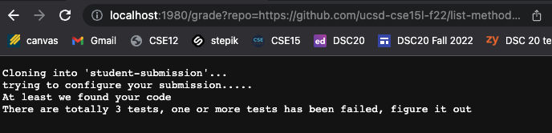

# Lab Report 5

## Part 1: My `grade.sh` in a code block

```
# Create your grading script here
set -e
CPATH=".:lib/hamcrest-core-1.3.jar:lib/junit-4.13.2.jar"
rm -rf student-submission
git clone $1 student-submission
cp TestListExamples.java student-submission
cp lib/hamcrest-core-1.3.jar student-submission
cp lib/junit-4.13.2.jar student-submission
echo "trying to configure your submission....."


if [[ -f "./student-submission/ListExamples.java" ]]
then
    echo "At least we found your code"
else
    echo "Even don't find the correct file"
fi

cp -r lib ./student-submission/

cp TestListExamples.java ./student-submission/

set +e


cd student-submission

javac -cp $CPATH *.java

java -cp $CPATH org.junit.runner.JUnitCore TestListExamples 1> stdout

CHECK=$(grep -o "Failures" stdout)
PASS=$(grep -E -o ".{0,2}test.{0,0}" stdout)
FAILURE=$(grep -E -o "Failures.{0,3}" stdout)

# check how many passed tests
if [[ $CHECK ]]
    then
        echo "There are totally 3 tests, one or more tests has been failed, figure it out"
        grep "Number of test you failed:" stdout
    else
        echo "There are totally 3 tests"
        echo "Number of tests you pass: $PASS, good job!"
fi
```


## Part 2: Screenshots
### Image 1:



URL for Image 1: https://github.com/ucsd-cse15l-f22/list-methods-corrected


### Image 2: 



URL for Image 2: https://github.com/ucsd-cse15l-f22/list-methods-compile-error


### Image 3: 



URL for Image 2: https://github.com/ucsd-cse15l-f22/list-methods-compile-error


# Part 3: Step-by-step description
in this part, we we will choose the second screenshoot as our example

### 1. `set -e`
this step will let the teminal know that 'Exit immediately if a command exits with a non-zero status'

stdout: None

stderr: None

### 2. `CPATH=".:lib/hamcrest-core-1.3.jar:lib/junit-4.13.2.jar"`
this step let java to look for a file or directory with the name

stdout: None

stderr: None

### 3. `rm -rf student-submission`
this step help us to clean the subfile called `student-submission`

stdout: None

stderr: None

### 4. `cp TestListExamples.java student-submission``cp lib/hamcrest-core-1.3.jar student-submission``cp lib/junit-4.13.2.jar student-submission`
this step import all of the packages and files that are needed. 

stdout: None

stderr: None

### 5. `echo "trying to configure your submission....."`
telling the author that the file has been imported and waited to be test. 

### 6. `if [[ -f "./student-submission/ListExamples.java" ]]`
this is a if statement,, in the examples, `ListExamples.java` file can be found in `student-submission`. 
Since this is the almost perfect version, and we imported and compile the submission file correctly, so this if statement is run. 

stdout: None

stderr: None

### 7. `echo "At least we found your code"`
the next line of if statement, which telling the author that the file has been found. 

stdout: None

stderr: None


### 8. `cp -r lib ./student-submission/``cp TestListExamples.java ./student-submission/`
copy and paste everything that is needed into student-submission so we can test the code

stdout: None

stderr: None

### 9. `cd student-submission`
get into student-submission file

stdout: None

stderr: None

### 10. `javac -cp $CPATH *.java`
compile thte code

stdout: None

stderr: None

### 11.`java -cp $CPATH org.junit.runner.JUnitCore TestListExample`
compile the Junit and test the file, and in this example, it passed all of the test. 

stdout: `JUnit version 4.13.2....Time: 0.007 OK (3 tests)` the result of Junit test

stderr: None

### 12. `if [[ $CHECK ]]`
It is a if statement. 
This if statement will be run since it pass all of the test

stdout: None

stderr: None

### 13 `echo "There are totally 3 tests"``echo "Number of tests you pass: $PASS, good job!"`
Since there is no error, this code will be run and will tell the author that all of the test has been passed. 

stdout: None

stderr: None

## Some if statement has not been executed. 

### 1. `echo "Even don't find the correct file"`
this code will be run if we can't find the file in the `student-submission`. 

stdout: None

stderr: None


### 2. `echo "There are totally 3 tests, one or more tests has been failed, figure it out"`
if there is error in in the submission, we will return this statement to tell the author that 
there is one or more error in the submission.

stdout: None

stderr: None


